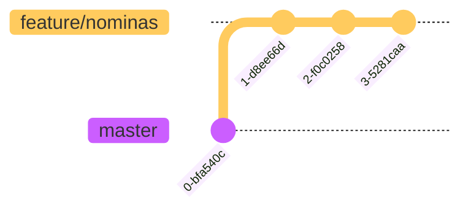
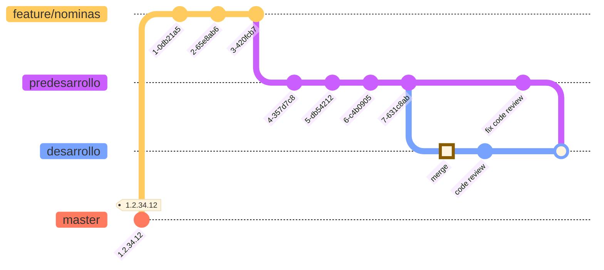

---
Gitflow SEP NEN.
---

El equipo de desarrollo deberá trabajar en construcción de nuevas piezas con el prefijo de feature.
En cada desarrollo el equipo deberá crear su rama desde master.

    feature/nominas
    feature/chueques
    feature/personal

Cuando el equipo de desarrollo ha completado el desarrollo lo envía a la rama predesarrollo.

En esta rama el equipo podrá validar que todos sus commits y poder agregar correciones antes de solicitar un despliegue.

Ya que el equipo está seguro de que el código de predesarrollo está completo deberá hacer el merge a la rama desarrollo.
En este punto se debe slicitar el Pull Request, con esto el equipo de arquitectrua deberá hacer un Code Review, en caso
de tener observaciones se le informa al equipo de desarrollo para que hagas las correciones.
Con la rama desarrollo lista, ejecutamos el pipeline de Jenkins, esta ejecución genera la rama candidata a llegar a
producción.

Después de la ejecución del script de desarrollo es generada la rama Release Candidate.

Además de consturir la rama release, se construyen los artefactos en que serán desplegados en ambiente de pruebas (
TEST,QA/UAT).

Suponiendo que las pruebas de las piezas desplegadas hayan sido satisfactorias, se solicita el despleigue a
producción
Para eso se hace el merge de release a master. Con el código en la rama master, es posible construir las piezas a
desplegar en producción.

